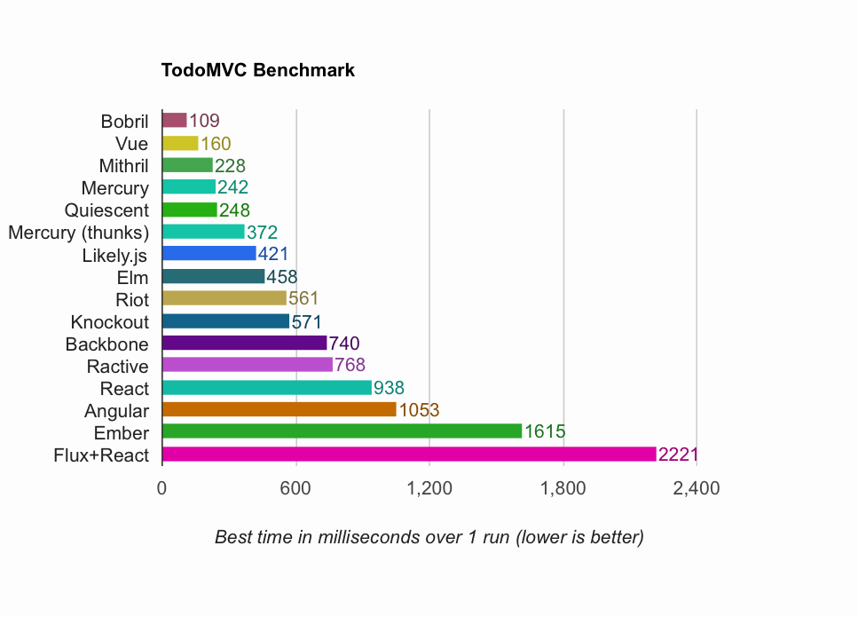

# TodoMVC Benchmark

Performance benchmarks for various TodoMVC implementations

## Results

*  OS X 10.10: Hackintosh (4xCore i7 @3.6GHz)

### Overall:

Vue and Mithril are kings.

React+Flux  is the slowest overall; Ember is trailing behind too.

### Chrome 40, OS X

### Firefox 35, OS X

### Safari 8, OS X

### Safari iOS 8, iPhone 6
