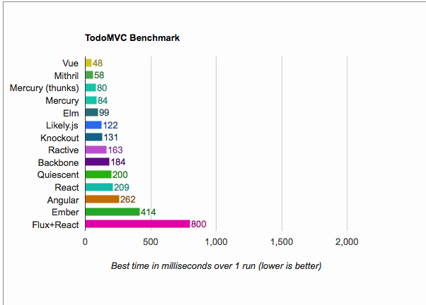

# TodoMVC Benchmark

Performance benchmarks for various TodoMVC implementations

## Results

*  OS X 10.8.5: Hackintosh (4xCore i7 @3.6GHz)

### Overall:

Ractive, Mithril and React are kings. Mercury is a close fourth.

Ember is the slowest overall; Angular and Knockout are trailing too.

### Chrome 40, OS X

### Firefox 35, OS X

### Safari 6.2, OS X

